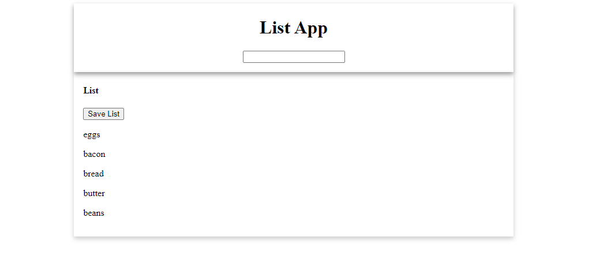
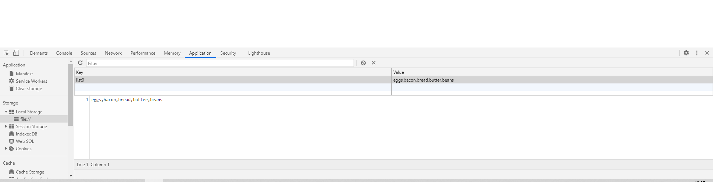

# listApp

Download the files and open up 'index.html'

Type something to add to your list in the input field and hit enter. Your item will then appear on the list.

If you want to save the list, click the save button.
This will save your list to your browser's local storage. If at any point, you clear your browser's local storage, your list will be gone.

